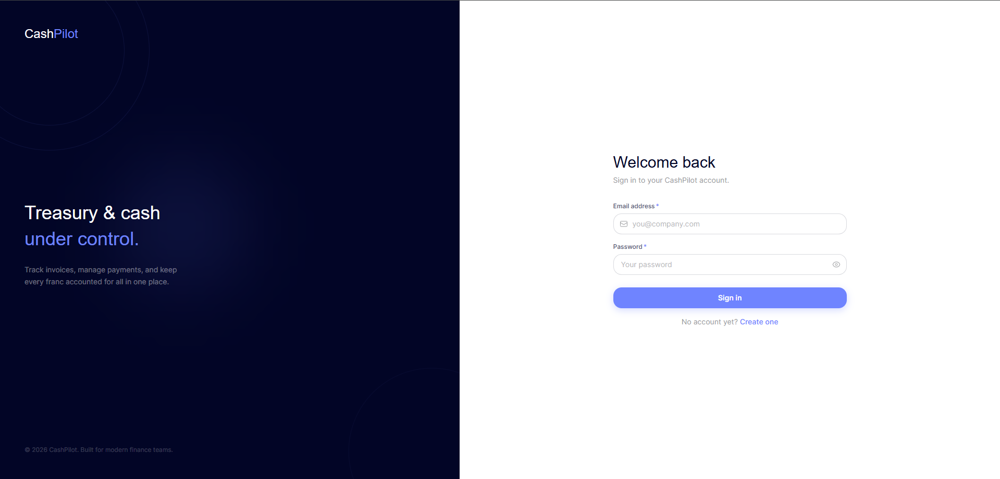
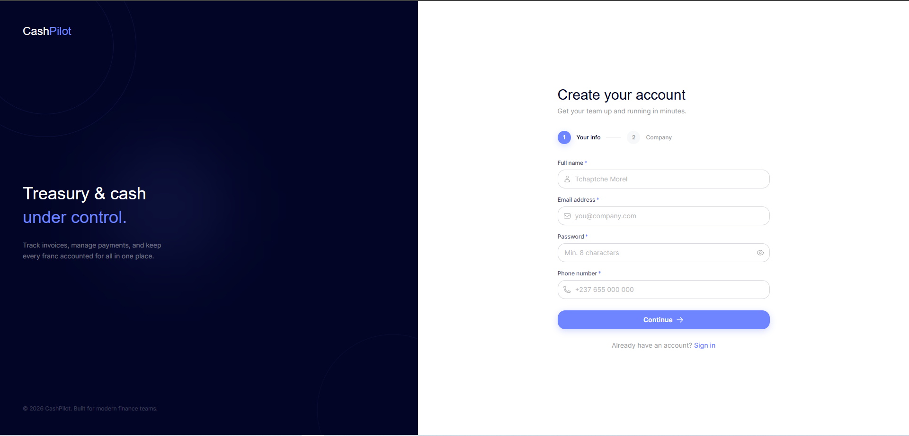
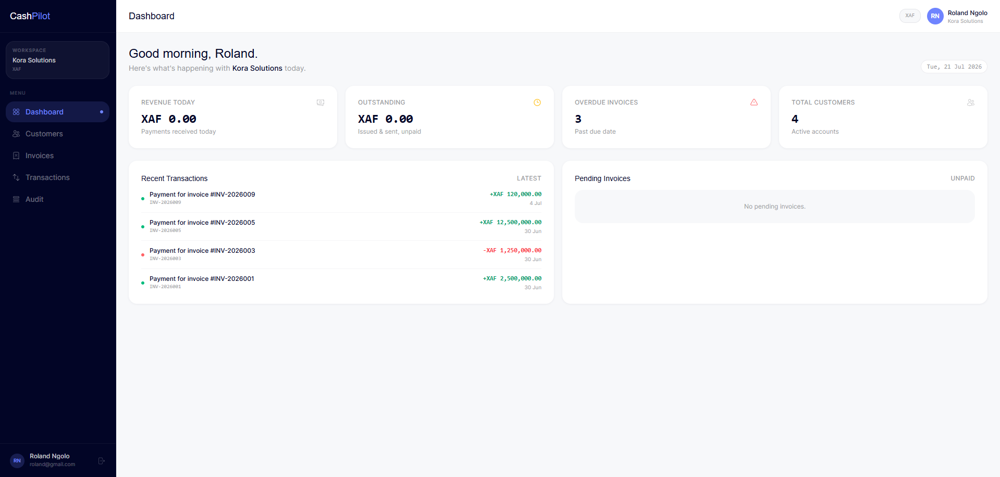
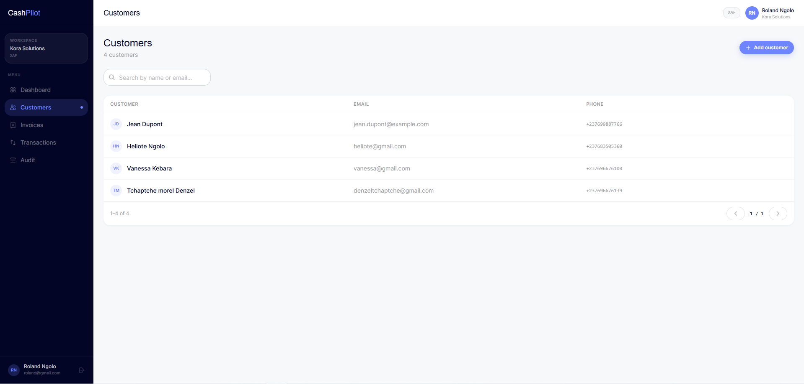
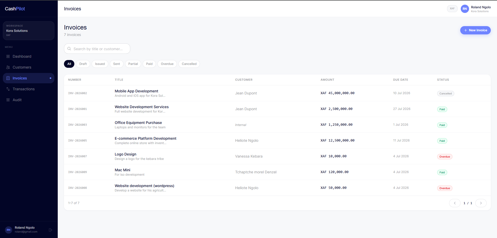
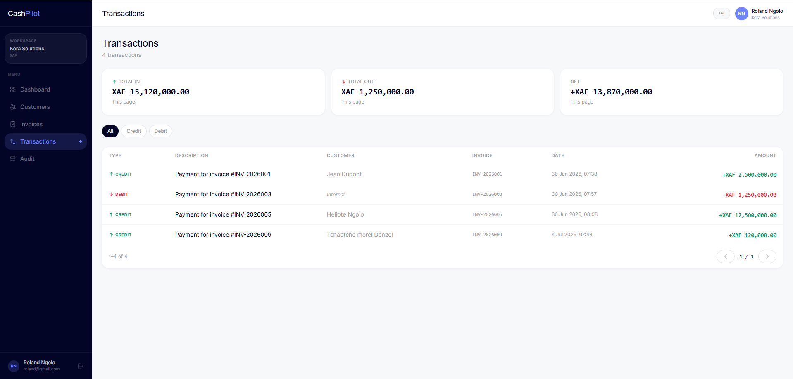
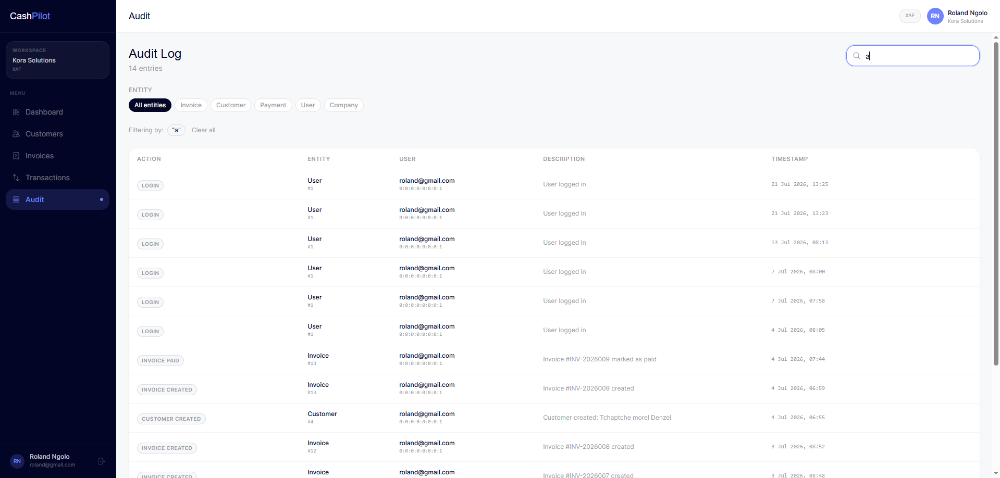

# CashPilot - Treasury & Cash Management Platform

## Overview
CashPilot is a modern treasury and cash management platform designed to help businesses track, control, and optimize their cash flow through invoices, payments, and financial records.

---

---

## Screenshots

### Auth Overview




### Dashbaord


### Customer Management


### Invoice Management


### Transactions


### Audit Trail


---

**Backend**
- Project Structure: Feature-based modular architecture
- Domain Modeling: Core entities (`Company`, `Customer`, `Invoice`, `Payment`, `LedgerEntry`, `User`)
- Multi-Tenancy: Row-level with `company_id` filtering + `TenantContext`
- Authentication: Login/Register with JWT + Refresh Token
- Database Schema: PostgreSQL with Flyway migrations (V1 to V5+)
- Backend Setup: Spring Boot 3 + Java 21
- Entities & Enums: `InvoiceStatus`, `LedgerEntryType` (DEBIT/CREDIT), general status fields
- Configuration: `.env` support + Flyway integration
- API Design: Consistent `ApiResponse<T>` wrapper + Global Exception Handler
- Redis Integration: Caching with Cache Aside Pattern, TTL, and manual invalidation
- Background Jobs: Scheduled tasks (e.g. overdue invoice detection)
- Audit Logging: Full activity tracking with filters (Action, Entity, Period)
- Modules Completed:
  - **Auth**: User + Company creation during registration
  - **Customer**: Full CRUD + Search by name/email
  - **Invoice**: CRUD + State Transitions (DRAFT → ISSUED → SENT → PAID, etc.) + Search/Filter
  - **Payment**: Triggered from Invoice pay endpoint with full orchestration
  - **Ledger**: Automatic entry on payment (CREDIT/DEBIT logic)
  - **Transaction Listing**: Full history view with type filter (CREDIT/DEBIT)
  - **Dashboard**: Metrics cards (Revenue Today, Outstanding, Overdue, Total Customers) + Recent Transactions + Pending Invoices

**Frontend**
- Project Structure: Feature-based modular architecture (`page` / `component` / `hook` / `store` / `api` per module)
- Stack: React 18 + TypeScript + Vite + Tailwind CSS v4 + Zustand
- Design System: Custom Tailwind theme (brand colors, typography scale, shared component classes)
- Authentication: Access-token-in-memory flow, silent session rehydration on page reload via `GET /api/auth/refresh`, protected routing
- Reusable UI Library: `Button` (5 variants, loading state), `Input`, `Select`, `Modal`, `Loader`, custom form-level validation
- Toast Notification System: Global Zustand-backed toast queue, backend message-code mapping
- Modules Completed:
  - **Auth**: Login / Register (2-step wizard: personal info → company info)
  - **Customer**: Full CRUD with paginated table and modal-based forms
  - **Invoice**: Full lifecycle UI: create, edit, view, delete, plus status-aware actions (Issue, Send, Pay, Cancel) with guarded availability per status
  - **Transactions**: Read-only paginated ledger view with type/status filtering and detail modal
  - **Dashboard**: Metrics cards + Recent Transactions + Pending Invoices

**DevOps**
- Docker Setup:
  - `docker-compose.yml` orchestrating PostgreSQL, Backend, Frontend, and Redis
  - Multi-stage `Dockerfile` for the backend (Maven build → JRE runtime)
  - Multi-stage `Dockerfile` for the frontend (Node build → Nginx static serve)
  - Custom `nginx.conf` for SPA client-side routing, gzip compression, and static asset caching
  - Shared Docker network (`cashpilot-network`) for inter-service communication
  - Environment-driven configuration via root `.env` (DB credentials, frontend API base URL injected at build time)
- CI/CD: GitHub Actions for frontend, backend, and Docker builds
- Live Deployment:
  - Client on Vercel, Server on Render (Docker), Database on Neon, Redis on Upstash

---

## Tech Stack

| Layer            | Technology                                             |
|------------------|----------------------------------------------------------|
| Backend          | Java 21, Spring Boot 3, Spring Security, JWT, Redis      |
| Database         | PostgreSQL, Flyway                                         |
| Frontend         | React 18, TypeScript, Vite, Tailwind CSS v4, Zustand       |
| Background Jobs  | Spring @Scheduled                                          |
| Containerization | Docker, Docker Compose                                     |
| Web Server       | Nginx (frontend static serving)                            |
| CI/CD            | GitHub Actions                                             |

---

## Project Structure


```
cashpilot/
├── client/              # React + TypeScript frontend
│   ├── src/
│   │   ├── app/         # Router, ProtectedRoute
│   │   ├── components/  # Shared UI library (Button, Input, Modal, etc.)
│   │   ├── modules/      # Feature modules (auth, customers, invoices, transactions)
│   │   ├── pages/         # Route-level pages
│   │   └── utils/         # Axios instance, toast system, validation helpers
│   ├── Dockerfile
│   ├── nginx.conf
│   └── package.json
├── server/              # Spring Boot backend
│   ├── src/
│   └── Dockerfile
├── workbench/           # SQL diagrams / schema design
├── .env                 # Shared environment variables
├── docker-compose.yml
└── README.md
```

---

## How to Run Locally

### Using Docker (Recommended)

This brings up PostgreSQL, the Spring Boot backend, and the React frontend (served via Nginx) together on a shared Docker network.

```bash
# 1. Go to project root
cd cashpilot

# 2. Copy the example environment file and adjust values if needed
cp .env.example .env

# 3. Start all services (postgres, backend, frontend)
docker compose --profile dev up --build -d
```

> The `--profile dev` flag is required, the backend and frontend services are scoped to the `dev` profile and will not start without it. This flag is a **local-only convenience** — it has no effect on the deployed environment, since Render and Vercel each build from their own service's Dockerfile/build settings directly and never read `docker-compose.yml`.

Once running:

| Service   | URL                    |
|-----------|-------------------------|
| Frontend  | http://localhost:5173   |
| Backend   | http://localhost:8080   |
| Postgres  | localhost:5432           |
| Redis     | localhost:6379           |

**Stopping services:**

```bash
docker compose --profile dev down          # stop containers, keep DB data
docker compose --profile dev down -v       # stop containers and wipe DB volume
```

**Rebuilding after changes:**

```bash
# Frontend env vars (e.g. VITE_API_BASE_URL) are baked in at build time 
# a code or .env change requires a rebuild, not just a restart.
docker compose build cashpilot-frontend
docker compose up -d cashpilot-frontend
```

**Viewing logs:**

```bash
docker compose logs -f cashpilot-frontend
docker compose logs -f cashpilot-backend
docker compose logs -f postgres
```

### Running Without Docker (Manual Setup)

**Backend**

```bash
cd server
./mvnw spring-boot:run
```

**Frontend**

```bash
cd client
npm install
npm run dev
```

The frontend dev server runs on `http://localhost:5173` and expects the backend at `http://localhost:8080` by default (configurable via `VITE_API_BASE_URL` in `client/.env`).

---

## Environment Variables

Defined in the root `.env` file (local Docker):

```bash
# Database
DB_PASSWORD=123456

# Frontend (baked into the build, requires rebuild on change)
VITE_API_BASE_URL=http://localhost:8080
```

See the [Deployment](#deployment) section below for the equivalent variables in the live environment.

---

## Deployment

CashPilot's live environment is split across four managed platforms instead of the single Docker network used locally. Each piece is deployed and configured independently.

| Layer     | Platform | Notes |
|-----------|----------|-------|
| Client    | Vercel   | Builds the React app from `client/`, static hosting |
| Server    | Render   | Runs `server/Dockerfile` (Spring Boot, Docker-based) |
| Database  | Neon     | Managed PostgreSQL, replaces local Postgres container |
| Redis     | Upstash  | Managed Redis, replaces local Redis container |

### Client (Vercel)

- Vercel builds `client/` directly — it does **not** use `client/Dockerfile` or `nginx.conf`; those are only relevant if the frontend is ever self-hosted as a container instead.
- Set in **Vercel → Project → Settings → Environment Variables**:
  ```bash
  VITE_API_BASE_URL=https://cashpilot-2l6p.onrender.com
  ```
- Because Vite bakes env vars into the build at build time, any change to `VITE_API_BASE_URL` requires a **redeploy**, not just a restart — same rule as local Docker.

### Server (Render)

- Render builds and runs `server/Dockerfile` directly; it does not read `docker-compose.yml` or use the `--profile dev` flag.
- Set in **Render → Service → Environment**:
  ```bash
  DATABASE_URL=<neon-connection-string>   # requires SSL
  REDIS_URL=rediss://default:<password>@<host>:6379   # note: rediss:// (TLS)
  JWT_SECRET=<your-secret>
  ```
- `application.properties` reads these via placeholders, e.g.:
  ```properties
  spring.data.redis.url=${REDIS_URL}
  spring.data.redis.ssl.enabled=true
  ```
- **CORS**: `SecurityConfig`'s allowed origins must include the deployed Vercel domain (not the backend's own Render URL):
  ```java
  configuration.setAllowedOrigins(List.of(
      "http://localhost:5173",
      "http://127.0.0.1:5173",
      "https://cash-pilot-ten.vercel.app"
  ));
  ```
- **Free tier idle spin-down**: Render's free tier spins the service down after ~15 minutes of inactivity, causing a slow first request afterward. An uptime bot (e.g. UptimeRobot) pinging a public health endpoint every 5 minutes keeps it warm:
  ```
  https://cashpilot-2l6p.onrender.com/actuator/health
  ```
  This requires exposing Spring Boot Actuator's health endpoint and permitting it in `SecurityConfig`:
  ```properties
  management.endpoints.web.exposure.include=health
  management.endpoint.health.show-details=never
  ```
  ```java
  .requestMatchers("/api/auth/**", "/actuator/health").permitAll()
  ```

### Database (Neon)

- Replaces the local Postgres container. Requires an SSL-enabled connection string (unlike the local compose default), passed to the server as `DATABASE_URL`.
- Flyway migrations run the same way as local — no changes needed to migration scripts themselves.

### Redis (Upstash)

- Replaces the local Redis container. The compose setup connects to Redis via the Docker network hostname (`redis`); in production this must instead point to Upstash's public TLS endpoint via `REDIS_URL`, never a hardcoded local hostname.

---

- **Free tier idle spin-down**: Render's free tier spins the service down after ~15 minutes of inactivity, causing a slow first request (~30–50s) afterward. Rather than working around this with a keepalive ping — which would just burn through the free-tier's monthly usage hours and risk violating the platform's fair-use terms — this is treated as a known, deliberate tradeoff of running on free infrastructure. The frontend surfaces a "waking up the server, this can take up to a minute" notice on cold start so it's transparent rather than looking like a bug.

  See [Architecture Decisions](#architecture-decisions) for the full reasoning behind the free-tier setup.

## Roadmap

- [ ] Role-based access control (RBAC)
- [ ] Advanced dashboard analytics & charts
- [ ] PDF invoice generation & export
- [ ] Email notifications (invoice sent, payment received, overdue reminders)
- [ ] Automated test coverage (unit + integration)
- [ ] CI/CD pipeline